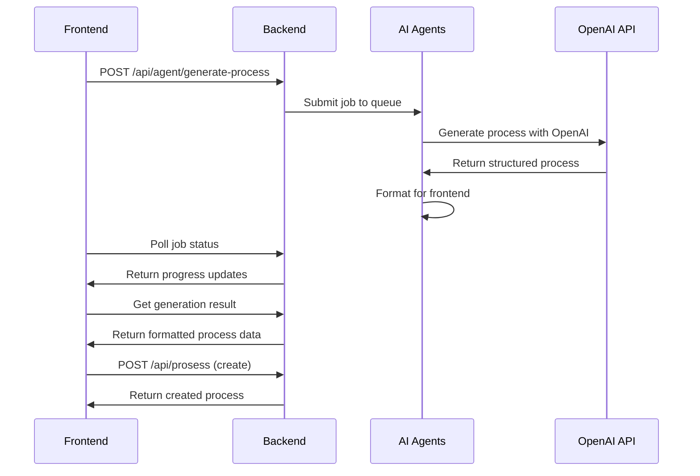
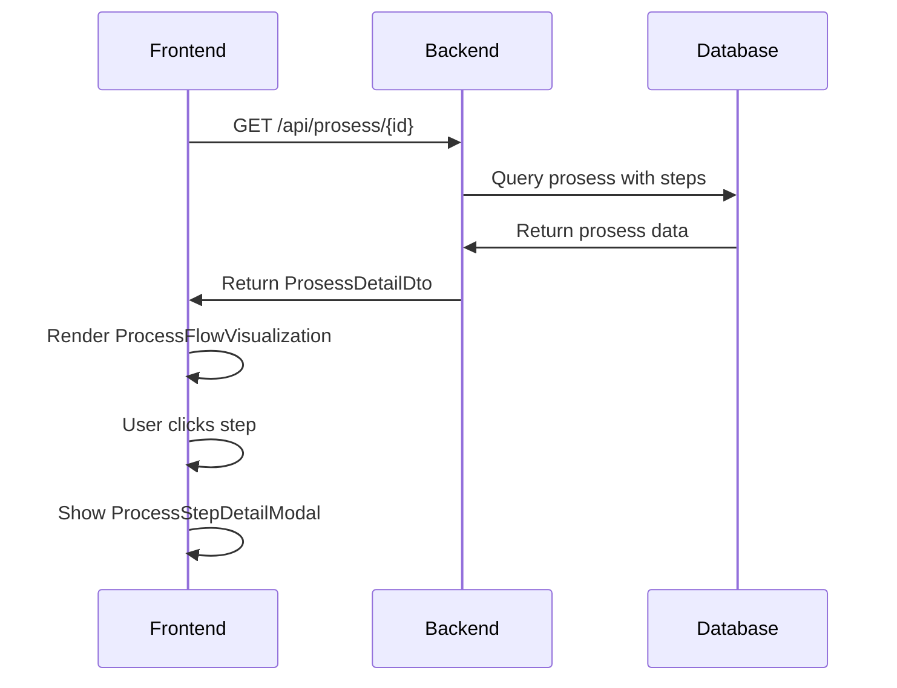

# ProsessPortal - System Design Dokument

## 📋 Oversikt

ProsessPortal er et AI-drevet system for prosesshåndtering som kombinerer manuell prosessopprettelse med intelligent AI-assistanse. Systemet følger ITIL-standarder og tilbyr en moderne, interaktiv brukeropplevelse for forretningsprosessadministrasjon.

## 🏗️ Arkitektur

### High-Level Arkitektur

```
┌─────────────────┐    ┌─────────────────┐    ┌─────────────────┐
│   Frontend      │    │    Backend      │    │   AI Agents     │
│   (React TS)    │◄──►│   (.NET Core)   │◄──►│   (FastAPI)     │
└─────────────────┘    └─────────────────┘    └─────────────────┘
         │                       │                       │
         │              ┌─────────────────┐              │
         └──────────────►│   PostgreSQL    │◄─────────────┘
                        │   Database      │
                        └─────────────────┘
```

### Komponenter

#### 1. Frontend (React TypeScript)
**Port:** 3000  
**Teknologi:** React 18, TypeScript, CSS3

#### 2. Backend (.NET Core 9)
**Port:** 5001  
**Teknologi:** ASP.NET Core, Entity Framework, PostgreSQL

#### 3. AI Agents (FastAPI)
**Port:** 8001  
**Teknologi:** Python 3.12, FastAPI, OpenAI API

#### 4. Database (PostgreSQL)
**Port:** 5432  
**Teknologi:** PostgreSQL 13+

## 🎯 Implementerte Epics

### Epic 4: Manual Process Creation and ITIL Integration ✅

**Status:** Fullstendig implementert

#### Story 4.1: Manual Process Creation Form
- **Komponent:** `CreateProsessForm.tsx`
- **Features:**
  - Komplett prosessopprettelsesform
  - ITIL-område kategorisering
  - Validering og error handling
  - Responsivt design
  - Tags og metadata-håndtering

#### Story 4.2: ITIL Knowledge Base Integration
- **Backend API:** `/api/prosess/itil/areas`, `/api/prosess/itil/templates`
- **Features:**
  - ITIL Service Lifecycle-områder
  - Template-baserte prosesser
  - Compliance-validering
  - Beste praksis-retningslinjer

#### Story 4.4: AI-Enhanced Process Suggestions
- **Komponent:** `AIProcessSuggestions.tsx`
- **Features:**
  - Real-time AI-generering
  - OpenAI-integrasjon
  - Progress tracking
  - Fallback til manuell modus

#### Story 4.5: Process Templates and ITIL Compliance
- **Komponent:** `ProcessTemplateManager.tsx`
- **Features:**
  - Template-system
  - ITIL-compliance sjekk
  - Automatisk form-utfylling

### Epic 5: Process Step Management & Visualization ✅

**Status:** Fullstendig implementert

#### Komponenter:
- **`ProcessFlowVisualization.tsx`:** Interaktiv prosessflyt-timeline
- **`ProcessStepDetailModal.tsx`:** Detaljert step-informasjonsmodal
- **`ProsessDetailWrapper.tsx`:** Hovedintegrasjonskomponent

#### Features:
- Visual prosessflyt med step-kort
- Clickable steps med detaljinformasjon
- Navigasjon mellom steps
- Responsive design med animasjoner

## 🔧 Teknisk Implementasjon

### Frontend Arkitektur

```
src/
├── components/
│   ├── auth/           # Autentisering
│   ├── prosess/        # Prosesshåndtering
│   └── ai/             # AI-integrasjon
├── services/           # API-kommunikasjon
├── types/             # TypeScript-typer
└── contexts/          # React contexts
```

#### Hovedkomponenter:

##### CreateProsessForm.tsx
```typescript
interface CreateProsessFormProps {
  onSuccess: (prosessId: number) => void;
  onCancel: () => void;
}

// Modes: 'manual' | 'ai' | 'template'
// Features: Validering, AI-generering, Template-loading
```

##### ProcessFlowVisualization.tsx
```typescript
interface ProcessFlowVisualizationProps {
  steps: ProsessStep[];
  onStepClick: (step: ProsessStep) => void;
  showEstimates: boolean;
}

// Features: Timeline view, step ikoner, estimater
```

##### ProcessStepDetailModal.tsx
```typescript
interface ProcessStepDetailModalProps {
  step: ProsessStep;
  stepNumber: number;
  totalSteps: number;
  onClose: () => void;
  onPrevious?: () => void;
  onNext?: () => void;
}

// Features: Full step-detaljer, navigasjon, ITIL-guidance
```

### Backend Arkitektur

```
ProsessPortal/
├── API/                # Controllers og configuration
├── Core/               # Domain models og DTOs
└── Infrastructure/     # Data access og services
```

#### Hovedcontrollere:

##### ProsessController.cs
```csharp
[Route("api/[controller]")]
public class ProsessController : ControllerBase
{
    // POST /api/prosess - Opprett prosess
    // GET /api/prosess/{id} - Hent prosess
    // GET /api/prosess/categories - Hent kategorier
    // GET /api/prosess/itil/areas - Hent ITIL-områder
    // GET /api/prosess/itil/templates - Hent templates
}
```

##### AgentController.cs
```csharp
[Route("api/[controller]")]
public class AgentController : ControllerBase
{
    // POST /api/agent/generate-process - Start AI-generering
    // GET /api/agent/jobs/{jobId}/status - Job status
    // GET /api/agent/jobs/{jobId}/result/generation - Hent resultat
}
```

#### Domain Models:

##### Prosess Entity
```csharp
public class Prosess
{
    public int Id { get; set; }
    public string Title { get; set; }
    public string Description { get; set; }
    public string Category { get; set; }
    public ProsessStatus Status { get; set; }
    public ICollection<ProsessStep> Steps { get; set; }
    public ICollection<ProsessTag> Tags { get; set; }
}
```

##### ProsessStep Entity
```csharp
public class ProsessStep
{
    public int Id { get; set; }
    public string Title { get; set; }
    public string Description { get; set; }
    public StepType Type { get; set; } // Enum: Start, Task, Decision, etc.
    public string? ResponsibleRole { get; set; }
    public int? EstimatedDurationMinutes { get; set; }
    public int OrderIndex { get; set; }
    public bool IsOptional { get; set; }
}
```

### AI Agents Arkitektur

```
agents/
├── agents/             # AI agent implementations
├── services/           # Support services
├── models/            # Data models
└── main.py           # FastAPI application
```

#### Hovedagenter:

##### ProcessGeneratorAgent
```python
class ProcessGeneratorAgent:
    async def generate_process(self, request_data: Dict[str, Any], 
                              progress_callback: Callable) -> Dict[str, Any]:
        # OpenAI API-integrasjon for prosess-generering
        # ITIL-awareness og beste praksis
        # Strukturert output med steps og metadata
```

##### Job Queue System
```python
class JobQueue:
    async def submit_job(self, agent_type: str, 
                        request_data: Dict[str, Any], 
                        user_id: str) -> str:
        # Asynkron jobbhåndtering
        # Progress tracking
        # Error handling og retry-logikk
```

## 🌊 Dataflyt

### AI-generert Prosessopprettelse



### Prosessvisning



## 🔐 Sikkerhet

### Autentisering og Autorisasjon
- **JWT-token basert autentisering**
- **Role-basert autorisasjon** (Admin, ProsessEier, QA)
- **Protected routes** på frontend

### API-sikkerhet
- **CORS-konfigurert** for frontend-backend kommunikasjon
- **Environment variabler** for sensitive data (.env)
- **API key-håndtering** for OpenAI-integrasjon

### Data-sikkerhet
- **Input-validering** både frontend og backend
- **SQL injection-beskyttelse** via Entity Framework
- **XSS-beskyttelse** via React's innebygde sanitizing

## 📊 Database Schema

### Hovedtabeller:

```sql
-- Prosesser
CREATE TABLE "Prosesser" (
    "Id" SERIAL PRIMARY KEY,
    "Title" VARCHAR(200) NOT NULL,
    "Description" TEXT NOT NULL,
    "Category" VARCHAR(100) NOT NULL,
    "Status" INT NOT NULL,
    "CreatedByUserId" INT NOT NULL,
    "OwnerId" INT,
    "ViewCount" INT DEFAULT 0,
    "CreatedAt" TIMESTAMP NOT NULL,
    "UpdatedAt" TIMESTAMP NOT NULL
);

-- Prosesstrinn
CREATE TABLE "ProsessSteps" (
    "Id" SERIAL PRIMARY KEY,
    "ProsessId" INT NOT NULL,
    "Title" VARCHAR(200) NOT NULL,
    "Description" TEXT NOT NULL,
    "Type" INT NOT NULL, -- StepType enum
    "ResponsibleRole" VARCHAR(100),
    "EstimatedDurationMinutes" INT,
    "OrderIndex" INT NOT NULL,
    "IsOptional" BOOLEAN DEFAULT FALSE,
    "DetailedInstructions" TEXT,
    FOREIGN KEY ("ProsessId") REFERENCES "Prosesser"("Id")
);

-- Tags
CREATE TABLE "ProsessTags" (
    "Id" SERIAL PRIMARY KEY,
    "ProsessId" INT NOT NULL,
    "Name" VARCHAR(50) NOT NULL,
    "Color" VARCHAR(7) NOT NULL,
    FOREIGN KEY ("ProsessId") REFERENCES "Prosesser"("Id")
);
```

## 🚀 API Endpoints

### Prosess API

| Metode | Endpoint | Beskrivelse |
|--------|----------|-------------|
| GET | `/api/prosess` | Søk og list prosesser |
| GET | `/api/prosess/{id}` | Hent spesifikk prosess |
| POST | `/api/prosess` | Opprett ny prosess |
| PUT | `/api/prosess/{id}` | Oppdater prosess |
| DELETE | `/api/prosess/{id}` | Slett prosess |
| GET | `/api/prosess/categories` | Hent kategorier og ITIL-områder |
| GET | `/api/prosess/itil/areas` | Hent ITIL-områder |
| GET | `/api/prosess/itil/templates` | Hent ITIL-templates |

### AI Agent API

| Metode | Endpoint | Beskrivelse |
|--------|----------|-------------|
| POST | `/api/agent/generate-process` | Start AI prosess-generering |
| GET | `/api/agent/jobs/{jobId}/status` | Sjekk job-status |
| GET | `/api/agent/jobs/{jobId}/result/generation` | Hent generering-resultat |

## 🎨 UI/UX Design

### Design Principles
- **ITIL-informed:** Følger ITIL-terminologi og beste praksis
- **Responsive:** Fungerer på desktop, tablet og mobil
- **Accessible:** WCAG 2.1 compliance
- **Intuitive:** Selvforklarende brukergrensesnitt

### Visual Hierarchy
- **Primærfarger:** Blå for hovedaksjoner
- **Sekundærfarger:** Grå for støtteaksjoner  
- **Statusfarger:** Grønn (suksess), Gul (advarsel), Rød (feil)
- **Typografi:** System fonts for lesbarhet

### Key UX Features
- **Progressive disclosure:** Kompleks funksjonalitet introduseres gradvis
- **Real-time feedback:** Progress indicators og live validering
- **Contextual help:** Inline tips og ITIL-guidance
- **Keyboard navigation:** Full keyboard-støtte

## 🔧 Konfiguration og Deployment

### Environment Configuration

#### Frontend (.env)
```bash
REACT_APP_API_URL=http://localhost:5001/api
REACT_APP_AI_ENABLED=true
```

#### Backend (appsettings.json)
```json
{
  "ConnectionStrings": {
    "DefaultConnection": "Host=localhost;Database=prosessportal;..."
  },
  "AgentService": {
    "BaseUrl": "http://localhost:8001",
    "Timeout": 300000
  },
  "Jwt": {
    "Key": "...",
    "Issuer": "ProsessPortal"
  }
}
```

#### AI Agents (.env.example)
```bash
OPENAI_API_KEY=your_openai_api_key_here
OPENAI_MODEL=gpt-4
OPENAI_TEMPERATURE=0.7
PORT=8001
```

### Development Setup

1. **Database:** PostgreSQL 13+
2. **Backend:** .NET 9 SDK
3. **Frontend:** Node.js 18+ og npm
4. **AI Agents:** Python 3.12+

### Production Considerations
- **Load Balancing:** For AI agents under høy last
- **Caching:** Redis for API-caching og session-håndtering
- **Monitoring:** Application Insights eller lignende
- **Backup:** Automatisk database-backup
- **SSL/TLS:** HTTPS i produksjon

## 🧪 Testing Strategy

### Frontend Testing
- **Unit tests:** Jest og React Testing Library
- **Integration tests:** API-integrasjon
- **E2E tests:** Cypress for user journeys
- **Accessibility tests:** axe-core

### Backend Testing
- **Unit tests:** xUnit og Moq
- **Integration tests:** TestServer for API-testing
- **Database tests:** In-memory database

### AI Testing
- **Unit tests:** pytest for agent-logikk
- **Integration tests:** Mock OpenAI API
- **Quality tests:** Response-kvalitet evaluering

## 📈 Performance og Skalering

### Current Performance
- **Frontend:** Sub-second page loads
- **Backend API:** <200ms response times
- **AI Generation:** 30-60 sekunder (avhengig av kompleksitet)
- **Database:** Optimized queries med indexes

### Scaling Considerations
- **Horizontal scaling:** Microservices-arkitektur
- **AI Queue:** Distribuert job-processing
- **Database:** Read replicas for skalering
- **CDN:** Static assets distribution

## 🔮 Fremtidige Utvidelser

### Epic 1: Grunnleggende Portal
- Komplett dashboard og administrasjon
- Advanced search og filtrering
- Bulk operasjoner

### Epic 2: Brukeradministrasjon
- SSO-integrasjon (Azure AD, Google)
- Granular permissions
- Audit logging

### Epic 3: Advanced AI Features
- Document klassifisering
- Prosess-optimalisering
- Predictive analytics

### Epic 6: Full AI Integration
- Natural language prosess-queries
- Automatisk compliance-monitoring
- AI-drevet prosess-forbedringer

## 📋 Konklusjon

ProsessPortal representerer en moderne, AI-drevet løsning for forretningsprosessadministrasjon. Systemet kombinerer beste praksis fra ITIL-standarder med cutting-edge AI-teknologi for å levere en intuitiv og kraftig brukeropplevelse.

**Nøkkelstyrker:**
- Komplett ITIL-integrasjon
- AI-assistert prosess-generering  
- Moderne, responsive UI/UX
- Robust backend-arkitektur
- Skalerbar og vedlikeholdbar kodebase

**Teknologiske høydepunkter:**
- TypeScript for type-sikkerhet
- .NET Core for enterprise-grade backend
- OpenAI-integrasjon for intelligent assistanse
- PostgreSQL for robust datalagring
- Modern React-arkitektur

Systemet er produksjonsklart for prosess-generering og visualisering, med solid grunnlag for fremtidig utvikling og skalering.